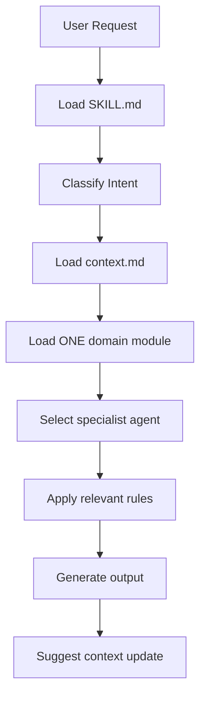
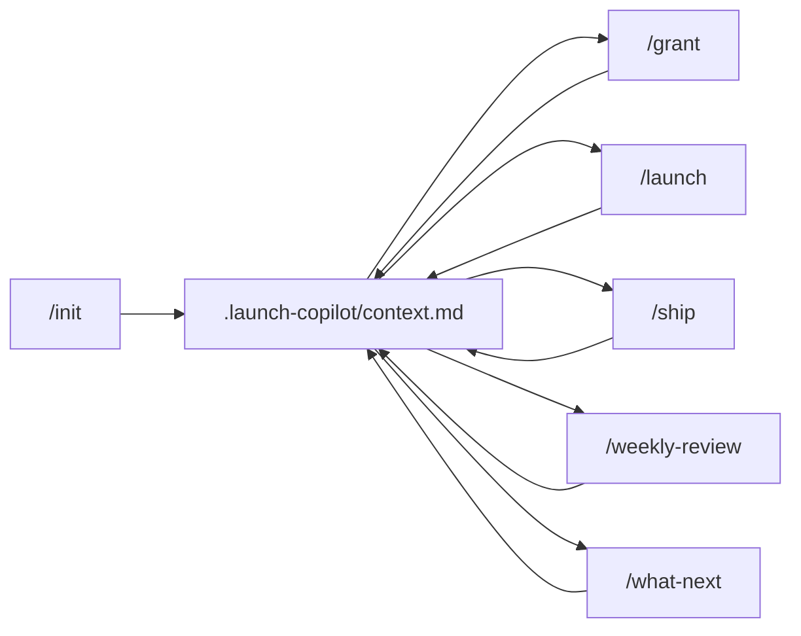
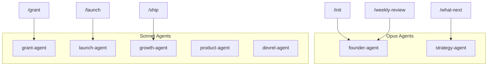

# Launch Copilot Architecture

This document describes how Launch Copilot works: progressive loading, context flow, routing, and module design.

## Design Philosophy

Launch Copilot is **not** a collection of prompts. It is a modular, progressively-loaded skill designed to merge into the official Solana AI Kit. Key principles:

1. **Token efficiency** — load only what's needed for the current task
2. **Context persistence** — shared state across all modules
3. **Specialist routing** — right agent for the right job
4. **Anti-fabrication** — never invent facts, programs, or metrics
5. **Stage awareness** — advice matches project lifecycle

## Progressive Loading

Traditional approach (bad):

```
User request → Load entire 50KB skill → Generate response
```

Launch Copilot approach (good):

```
User request → Load SKILL.md (router, ~8KB)
            → Detect intent
            → Load project context (~2KB)
            → Load ONE domain module (~5-10KB)
            → Route to specialist agent
            → Generate response
```

Total context per request: ~15-20KB instead of 50KB+.

### Loading Sequence



### What Loads When

| Always Loaded | Conditionally Loaded |
|--------------|---------------------|
| `SKILL.md` | `grant.md` (for grant tasks) |
| `project-context.md` | `launch.md` (for launch tasks) |
| | `ship.md` (for content tasks) |
| | `weekly-review.md` (for reviews) |
| | `strategy.md` (for prioritization) |
| | `ecosystem.md` (for grant/strategy) |

## Context Flow

All modules share a single source of truth: `.launch-copilot/context.md`.



### Context Schema

Structured YAML front-matter + markdown notes:

```yaml
---
project: { name, description, stage, ... }
funding: { status, grants_applied, ... }
team: [...]
token: { has_token, status, ... }
integrations: [...]
goals: { list, next_milestone }
updated: "ISO date"
---
# Notes (freeform)
```

### Read/Write Rules

1. **Read before act** — every command reads context first
2. **Ask only for missing** — never re-ask populated fields
3. **Write back** — suggest context updates after every command
4. **Merge, don't overwrite** — preserve existing data on updates
5. **Bump `updated`** — set date on every write

## Routing Architecture

### Intent Classification

`SKILL.md` classifies user intent and routes to the correct module:

| Intent Signal | Module | Command |
|--------------|--------|---------|
| "set up", "initialize", "new project" | project-context | `/init` |
| "grant", "apply", "funding", "hackathon" | grant | `/grant` |
| "launch", "go-live", "mainnet", "checklist" | launch | `/launch` |
| "tweet", "post", "changelog", "ship" | ship | `/ship` |
| "weekly", "review", "retrospective" | weekly-review | `/weekly-review` |
| "what next", "prioritize", "should I" | strategy | `/what-next` |

### Agent Selection

Each module maps to a specialist agent:



### Delegation

Agents delegate to each other when requests span domains:

- founder-agent → strategy-agent (for deep prioritization)
- strategy-agent → grant-agent (when grant is top priority)
- grant-agent → product-agent (for milestone scoping)
- launch-agent → growth-agent (for announcement content)

## Module Design

Each domain module follows a consistent structure:

1. **When to Use** — trigger conditions
2. **Prerequisites** — required context fields
3. **Procedure** — step-by-step generation logic
4. **Output Structure** — formatted deliverables
5. **Quality Rules** — anti-fabrication, stage-awareness
6. **After Generation** — suggested next commands

### Module Dependencies

```
project-context.md (foundation — all modules depend on this)
    ├── grant.md → ecosystem.md
    ├── launch.md
    ├── ship.md
    ├── weekly-review.md → launch.md (readiness check)
    └── strategy.md → ecosystem.md
```

## Rules System

Rules apply quality standards scoped by file globs:

| Rule File | Applies To | Key Standards |
|-----------|-----------|---------------|
| `grant.md` | Grant content | No fabricated traction, verified programs only |
| `launch.md` | Launch plans | Monitoring required, rollback verified |
| `strategy.md` | Recommendations | Stage-appropriate, max 3 P0 items |
| `voice.md` | Social content | No price talk, authentic voice |

Rules use front-matter globs to auto-apply when working in relevant files.

## Commands vs. Modules vs. Agents

| Layer | Purpose | Example |
|-------|---------|---------|
| **Command** | User-invoked workflow with steps | `/grant` — 9-step procedure |
| **Module** | Domain knowledge and output templates | `grant.md` — application structure |
| **Agent** | Persona with responsibilities and delegation | `grant-agent` — grant writing specialist |

Commands orchestrate modules through agents.

## Anti-Fabrication Architecture

Fabrication prevention is structural, not just instructional:

1. **Ecosystem whitelist** — `ecosystem.md` lists verified programs only
2. **Context sourcing** — all facts must come from context or ecosystem.md
3. **Labeling system** — `[NEEDS INPUT]`, `Target:`, `We assume...`
4. **Rules enforcement** — scoped rules auto-apply to relevant files
5. **Agent instructions** — each agent has explicit anti-fabrication rules

## Installation Architecture

```
install.sh / install-custom.sh
    ├── Copy skill/ → ~/.claude/skills/launch-copilot/
    ├── Copy agents/ → ~/.claude/agents/ (or project .claude/)
    ├── Copy commands/ → ~/.claude/commands/ (or project .claude/)
    ├── Copy rules/ → ~/.claude/rules/ (or project .claude/)
    └── Copy CLAUDE.md → ~/.claude/CLAUDE.md
```

Standalone — no dependency on solana-dev-skill. Optional cross-references only.

## Extension Points

To add a new capability:

1. Create `skill/new-module.md` with standard structure
2. Add routing entry in `SKILL.md`
3. Create `agents/new-agent.md` with front-matter
4. Create `commands/new-command.md` with step procedure
5. Add rules in `rules/` if needed
6. Update README and examples

Follow the same progressive loading pattern — never add to the monolith.

## Comparison with solana-game-skill

| Aspect | solana-game-skill | launch-copilot |
|--------|-------------------|----------------|
| Focus | Game development | Founder operations |
| Dependency | Extends solana-dev-skill | Standalone |
| Context | Per-project via code | `.launch-copilot/context.md` |
| Modules | Unity, mobile, payments | Grant, launch, ship, strategy |
| Agents | game-architect, unity-engineer | founder-agent, grant-agent, etc. |
| Loading | Progressive disclosure | Progressive disclosure |

Same architecture pattern, different domain.
